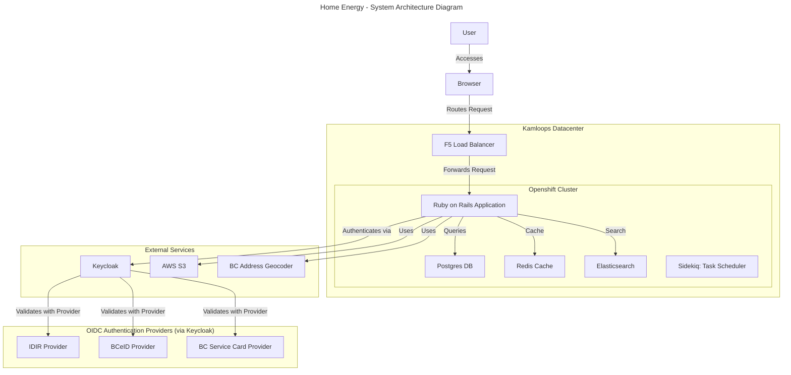

# System Architecture Diagram

```mermaid
---
title: Home Energy - System Architecture Diagram
---

graph TD;
    %% Authentication Flow (Confidential OIDC via Keycloak)
    User[User] -->|Accesses| Browser[Browser]
    Browser -->|Routes Request| F5[F5 Load Balancer]
    F5 -->|Forwards Request| RailsApp[Ruby on Rails Application]
    RailsApp -->|Authenticates via| Keycloak[Keycloak]
    
    %% OIDC Providers (Proxied via Keycloak)
    subgraph "OIDC Authentication Providers (via Keycloak)"
        OIDC_IDIR[IDIR Provider]
        OIDC_BCeID[BCeID Provider]
        OIDC_BCSC[BC Service Card Provider]
    end

    Keycloak -->|Validates with Provider| OIDC_IDIR
    Keycloak -->|Validates with Provider| OIDC_BCeID
    Keycloak -->|Validates with Provider| OIDC_BCSC

    %% Kamloops Datacenter
    subgraph "Kamloops Datacenter"
        F5
        subgraph "Openshift Cluster"
            RailsApp
            Postgres[Postgres DB]
            Redis[Redis Cache]
            Elastic[Elasticsearch]
            Sidekiq[Sidekiq: Task Scheduler]
        end
    end

    %% External Services
    subgraph "External Services"
        AWS_S3[AWS S3]
        Geocoder[BC Address Geocoder]
        Keycloak
    end

    %% Data Flow
    RailsApp -->|Queries| Postgres
    RailsApp -->|Cache| Redis
    RailsApp -->|Search| Elastic
    RailsApp -->|Uses| AWS_S3
    RailsApp -->|Uses| Geocoder
```
